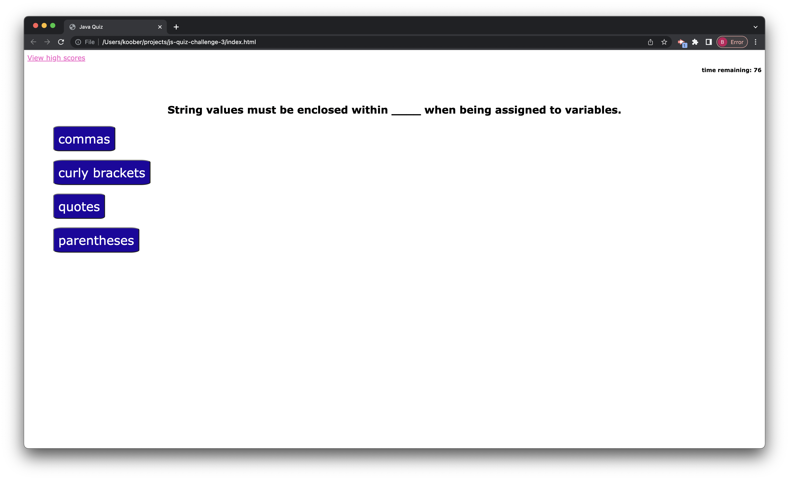

# JavaScript Quiz Creation

## Objective

- Create a quiz based on the given criteria
- Properly utilize an html, css, and JS to replicate it as best as possible

## User Story

- AS A coding boot camp student
- I WANT to take a timed quiz on JavaScript fundamentals that stores high scores
- SO THAT I can guage my progress compared to my peers

## Results

- Redid the JavaScript finding better methods to create the needed outcomes

## Screenshot of Deployed Site

## Deployed Link

-

### Created by Brian Koo
